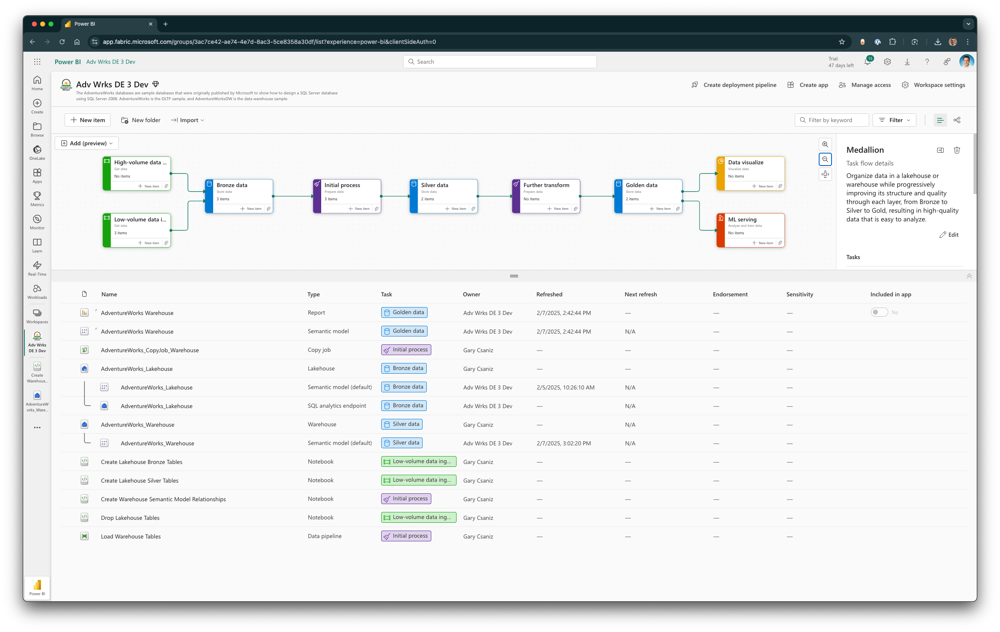

# Microsoft Fabric AdventureWorks Database

Uses the raw CSV files from the AdventureWorks database originally published by Microsoft to show how to create a Medallion Architecture in Microsoft Fabric.


**Fabric AdventureWorks Architecture**

The CSV files from the the AdventureWorks folder out on the [Microsoft samples GitHub](https://github.com/microsoft/sql-server-samples) initially had issues. It was discoverd that they were encoded with UTF-16LE:

```
👉 file -I DimAccount.csv
DimAccount.csv: text/plain; charset=utf-16le
```

The issue was fixed by converting all the CSV files to UTF-8. A bash shell script is included in this repo for future conversions, if necessay. An OS conversion program was used and is the key to the script execution; please check if is avaialbe on your OS or use an equivelent one:

```
# Convert the file from UTF-16LE to UTF-8 using iconv
iconv -f UTF-16LE -t UTF-8 DimAccount.csv >DimAccount_UTF8.csv
```
