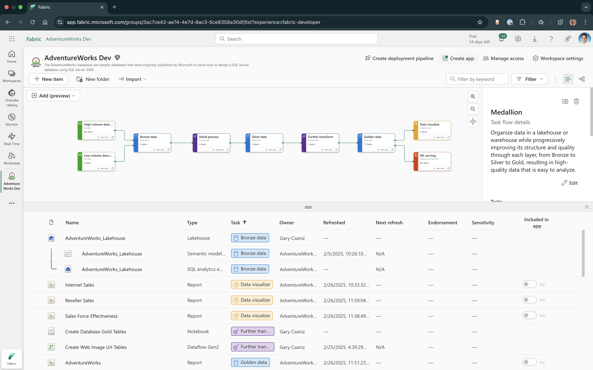
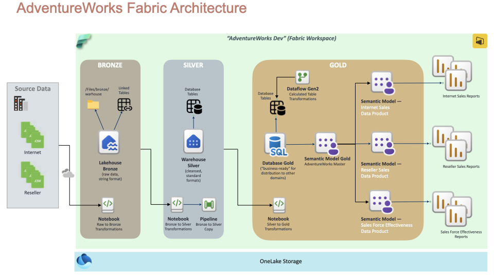
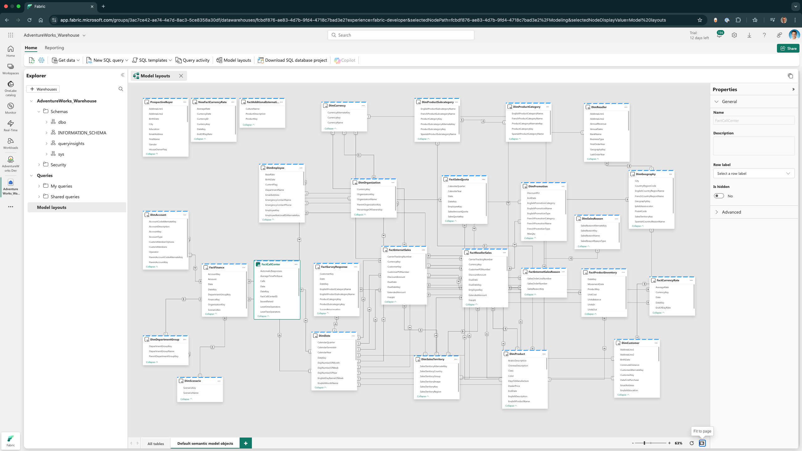

# Microsoft Fabric AdventureWorks Database

Demonstrates a best practice approach for building a Microsoft Fabric Medallion Architecture using the real-world scenario of vendor-provided raw CSV files. We get these files from the Microsoft samples project on GitHub.

The project uses the new Microsoft Fabric Task Flow, a powerful feature that streamlines data workflows, helping organizations manage and automate their data processes more efficiently. Microsoft Fabric provides a built-in template for creating a Medallion Architecture, which simplifies the process of designing and implementing a structured data lakehouse. This template follows the Bronze, Silver, and Gold layer approach, ensuring data is efficiently ingested, transformed, and curated for analytics.


**Fabric AdventureWorks Task Flow -- Medallion Architecture**

## Prerequisites

In order to leverage this solution, you'll need a Microsoft Fabric capacity (F2 or higher) and a Power BI licence (Pro or PPU).

## Architecture

The intent of this project is to illustrate a best practice approach to build a Medallion Architecture in Microsoft Fabric by using a different fit-for-purpose component for each layer. The `Lakehouse` is used for raw data in the **_BRONZE_** layer, where each attribute is a string to ensure every row is ingested without error.

A `Warehouse` hosts the **_SILVER_** layer with the data model needed to meet the business requirements. It was chosen for two reasons;

1. Many data types are not supported in Lakehouses. For instance, I faced challenges with boolean and binary (images).
1. The SQL to create primary and foreign keys is not supported in Lakehouses.

Finally, the **_GOLD_** layer utilizes `SQL Database` because it supports the richest set of SQL language and development capabities (e.g., stored procedures, user-defined functions, etc). The `Semantic Model` artifacts are built from the database to create a data mesh design and expose information as data products. This approach allows for reusable models for various users and business domains, enabling more fine-grained security, governance, and self-service reporting.


**Fabric AdventureWorks Architecture**

## Phase 1 -- Raw to Bronze

### Step 1.1
Create a `Workspace` for the project; I called mine "AdventureWorks Dev". Many of us struggle with naming conventions and standards. You don't want the name too long as it quickly gets truncated on the right-side by the UI.

We do need separate workspaces for dev, test and prod. Ideally, the best practice is to have separate workspaces for data and reports as well; this allows for more fine-grained access control required by large enterprises. The data workspaces can be further sepated by layer. To keep things simple whill still demonstrating the key concepts, I choose just to have a single workspace for development.

### Step 1.2
Create the `Lakehouse` that will serve as the **_BRONZE_** layer; I called mine "AdventureWorks_Lakehouse". Create a folder named "bronze" (the layer) and a subfolder named "warehouse" (the application).

### Step 1.3
Download the CSV files from the [Microsoft samples GitHub](https://github.com/microsoft/sql-server-samples) site. These CSV files from the AdventureWorks folder initially had issues. It was discoverd that they were encoded with UTF-16LE:

```
👉 file -I DimAccount.csv
DimAccount.csv: text/plain; charset=utf-16le
```

The issue was fixed by converting all the CSV files to UTF-8. A bash shell script is included in this repo for future conversions, if necessay. An OS conversion program was used and is the key to the script execution; please check if is avaialbe on your OS or use an equivelent one:

```
# Convert the file from UTF-16LE to UTF-8 using iconv
iconv -f UTF-16LE -t UTF-8 DimAccount.csv >DimAccount_UTF8.csv
```

I saved you the pain of this step, so you can simply upload the converted, UTF-8 formatted CSV files from this repo to the "warehouse" folder in your Lakehouse.

### Step 1.4
In most real-wold scenarios, this step will not be necessary. It is only required when the source data does not have headers. Why did Microsoft extract the data without specifying the column names? Who knows! 

In rare cases, the data provider may suppy separate metadata files that describe the data files. This the case here, so you need to get the CREATE TABLE SQL from the Microsoft samples project, one per data file.

Again I will save you this step, just upload the `.sql` files from this repo to the "warehouse" folder in your Lakehouse.

### Step 1.5
We are now ready to load the data into the `Lakehouse`. For this pupose, we use a `Notebook` named `"Process Raw to Bronze.ipynb"` which is located in the `"notebooks"` folder. It uses PySpark to read the the text CSV-formatted files into dataframes, deriving the schema from the correspongig `.sql` file. Since this is raw data, we do not want to discard rows that have invalid values (e.g., a character in a numeric field). Therefore, the schema configures all columns as `String()` data types.

Create a new `Notebook` in your workspace, import the code file, and run it to load the **_BRONZE_** layer tables.

## Phase 2 -- Bronze to Silver
### Step 2.1
Create the `Warehouse` that will serve as the **_SILVER_** layer; I called mine "AdventureWorks_Warehouse".

### Step 2.2
Create the tables using the metadata that was supplied by the data source provider, in this case, Microsoft. The metadata specifies the functional requirements for each column: data type, nullable, and length.

The code is provided for you in this repo. Open the `SQL Endpoint` view, create a new SQL Query, copy and paste the script in the `"sql/warehouse"` folder named `"Create Warehouse Tables.sql"` and execute to create the fact and dimension tables.

### Step 2.3
Create a new `Notebook` in your workspace, import the code file named `"Process Bronze to Silver.ipynb"` which is located in the `"notebooks"` folder, and run it to load the **_SILVER_** layer tables.

In the Medallion Architecture, the **_SILVER_** layer is where data undergoes cleaning, validation, and transformation to create a more refined and consistent dataset. This layer is crucial for ensuring data quality and reliability, making it suitable for business intelligence and machine learning applications. The specific details for this project are as follows:
- Converts text strings to binary format
- Convert texts string to boolean format
- Removes multi-byte characters
- Performs data type conversion
- Executes nullable transformations

### Step 2.4
We must now create the primary and foreign key relationships in the **_SILVER_** layer to help achieve its' purpose by:
1. *Ensuring Data Integrity:* Primary and foreign keys enforce referential integrity, ensuring that relationships between tables are consistent and valid. This helps maintain the accuracy and reliability of the data.
1. *Enabling Efficient Data Joins:* These key relationships facilitate efficient joining of tables, allowing for seamless integration of data from different sources. This is essential for creating a unified view of key business entities and transactions.
1. *Supporting Dimensional Modeling:* Primary and foreign keys are fundamental to dimensional modeling, which is often used in the **_GOLD_**_** layer for advanced analytics. By establishing these relationships in the **_SILVER_** layer, the data is better prepared for further aggregation and analysis in the Gold layer.

The code is provided for you in this repo. Open the `SQL Endpoint` view, create 2 new SQL Queries, copy and paste the scripts in the `"sql/warehouse"` folder, the first named `"Add Warehouse Primary Keys.sql"`and the second named `"Add Warehouse Foreign Keys.sql"`, and finally execute each to create the keys and relationships.

The final outcome of this phase will be a fully populated star-schema modeled data warehouse:


**Fabric AdventureWorks Warehouse -- Star-Schema Data Model**

## Phase 3 -- Silver to Gold
> Coming soon!
