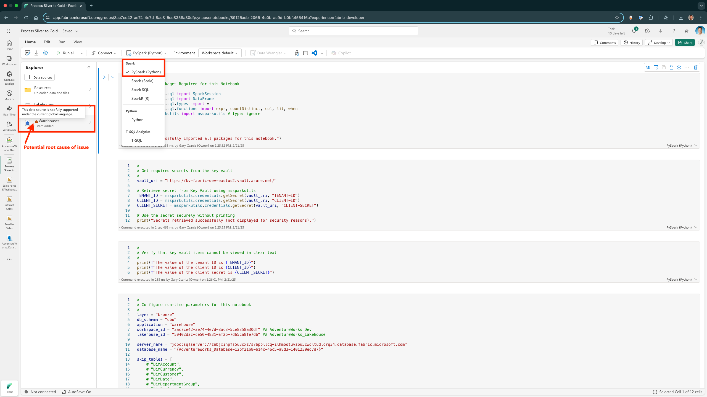
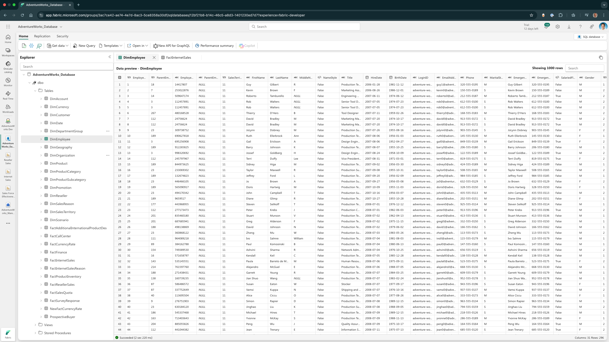
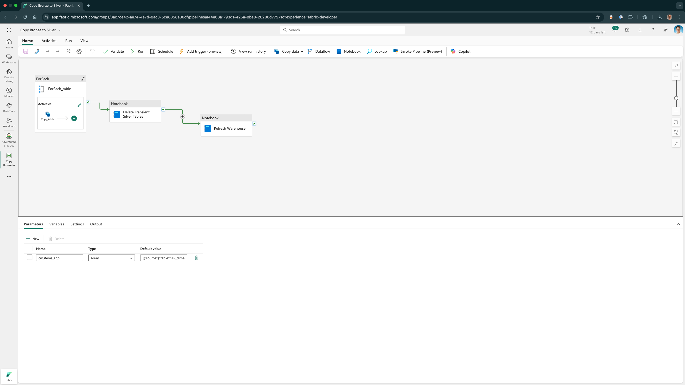
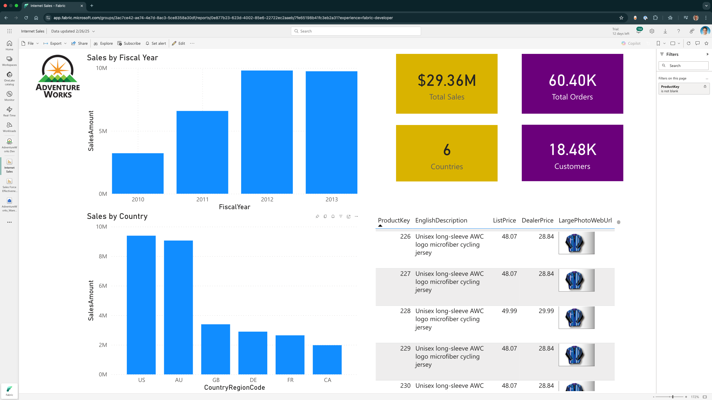
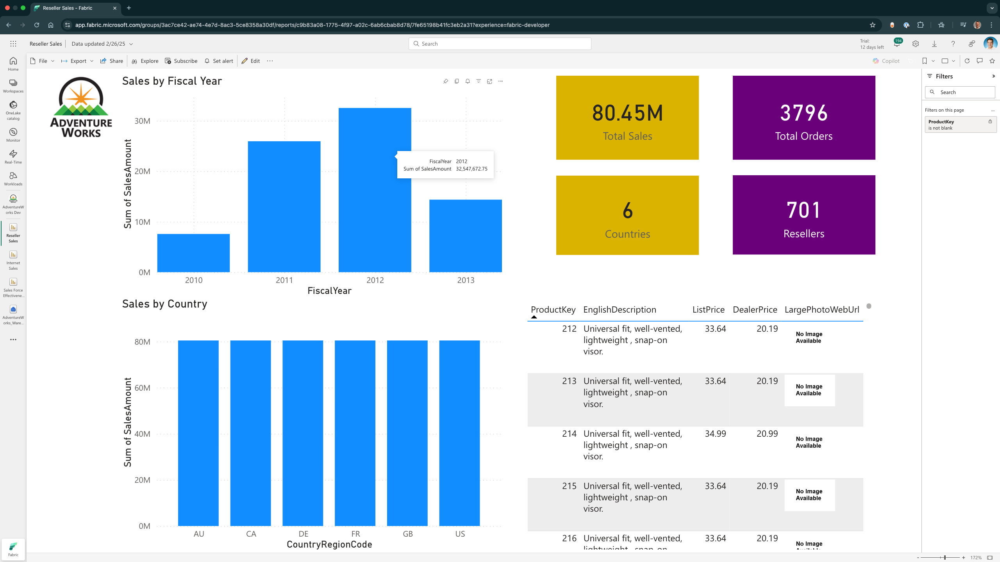
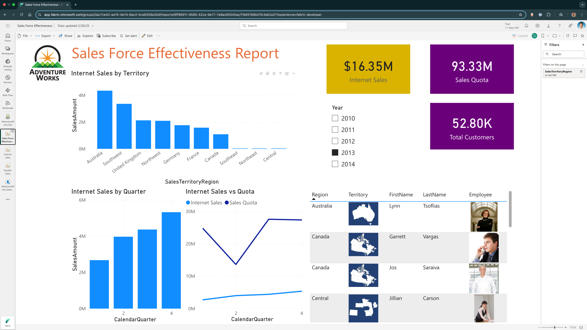

# Microsoft Fabric AdventureWorks Database

Demonstrates a best practice approach for building a Microsoft Fabric Medallion Architecture using the real-world scenario of vendor-provided raw CSV files. We get these files from the Microsoft samples project on GitHub.

The project uses the new Microsoft Fabric Task Flow, a powerful feature that streamlines data workflows, helping organizations manage and automate their data processes more efficiently. Microsoft Fabric provides a built-in template for creating a Medallion Architecture, which simplifies the process of designing and implementing a structured data lakehouse. This template follows the Bronze, Silver, and Gold layer approach, ensuring data is efficiently ingested, transformed, and curated for analytics.


**Fabric AdventureWorks Task Flow -- Medallion Architecture**

## Prerequisites

In order to leverage this solution, you'll need a Microsoft Fabric capacity (F2 or higher) and a Power BI license (Pro or PPU).

## Architecture

The intent of this project is to illustrate a best practice approach to build a Medallion Architecture in Microsoft Fabric. It is designed to leverage specific fit-for-purpose components for each layer of the architecture. This project defines a reference architecture which serves serves as a blueprint for implementing a proven solution design. It provides a standardized framework that others can adopt and adapt, reducing ambiguity and accelerating implementation. In the context of Microsoft Fabric, this reference architecture helps teams align on best practices for data ingestion, transformation, and analytics across the platform’s integrated components.

In this repository you will find a demonstration of the Medallion Architecture pattern—**_BRONZE_**, **_SILVER_**, and **_GOLD_** layers—using Microsoft Fabric’s `Lakehouse`, `Warehouse`, and `SQL Database` respectively. Each layer is purposefully designed to optimize data quality, performance, and usability. By showcasing how to ingest raw CSV files, transform them through PySpark notebooks and pipelines, and expose curated data products via semantic models, the project offers a hands-on, working example that others can replicate or extend.

The business value of this approach is clear: it enables scalable, governed, and reusable data products that support self-service analytics and operational reporting. Organizations benefit from faster time-to-insight, improved data reliability, and a modular architecture that can evolve with changing needs. This reference implementation helps bridge the gap between technical design and business outcomes, making Microsoft Fabric adoption more accessible and impactful.


**Fabric AdventureWorks Architecture**

### Rationale for Architectural Decisions
The `Lakehouse` is used for the **_BRONZE_** layer because of its schema flexibility and raw data preservation for structured, semi-structured and unstructured data.​
- Offers schema-agnostic ingestion, ideal for raw vendor data.​
- Using StringType avoids ingestion failures due to malformed or unexpected values.​
- Supports append-only, immutable storage, aligning with audit and lineage best practices.

A `Warehouse` hosts the **_SILVER_** layer to support the data modeling features needed to meet the business requirements.​
- Supports indexing for faster queries.​
- Strong schema enforcement, with SQL to create primary and foreign keys to support referential integrity and dimensional modeling.​
- High concurrency, optimized for BI workloads needed for operational reporting on key data engineering processes.​
- Better integration with Power BI for semantic modeling and performance optimization.​

The **_GOLD_** layer utilizes `SQL Database` because it supports the richest set of SQL language and development capabilities (e.g., stored procedures, user-defined functions, etc.).​
- Fast performance w/o refresh delays -- data is automatically replicated in near real-time to OneLake and converted to Delta Parquet, then read in Direct Lake mode.​
- Enables self-service reporting by creating Semantic models as reusable data products for business user consumption.​
- More fine-grained security and data masking capabilities.


## Phase 1 -- Raw to Bronze

### Step 1.1
Create a `Workspace` for the project; I called mine "AdventureWorks Dev". Many of us struggle with naming conventions and standards. You don't want the name too long as it quickly gets truncated on the right-side by the UI.

We do need separate workspaces for dev, test and prod. Ideally, the best practice is to have separate workspaces for data and reports as well; this allows for more fine-grained access control required by large enterprises. The data workspaces can be further separated by layer. To keep things simple while still demonstrating the key concepts, I choose just to have a single workspace for development.

### Step 1.2
Create the `Lakehouse` that will serve as the **_BRONZE_** layer; I called mine "AdventureWorks_Lakehouse". Create a folder named "bronze" (the layer) and a subfolder named "warehouse" (the application).

### Step 1.3
Download the CSV files from the [Microsoft samples GitHub](https://github.com/microsoft/sql-server-samples) site. These CSV files from the AdventureWorks folder initially had issues. It was discoverd that they were encoded with UTF-16LE:

```
👉 file -I DimAccount.csv
DimAccount.csv: text/plain; charset=utf-16le
```

The issue was fixed by converting all the CSV files to UTF-8. A bash shell script is included in this repo for future conversions, if necessary. An OS conversion program was used and is the key to the script execution; please check if is available on your OS or use an equivalent one:

```
# Convert the file from UTF-16LE to UTF-8 using iconv
iconv -f UTF-16LE -t UTF-8 DimAccount.csv >DimAccount_UTF8.csv
```

I saved you the pain of this step, so you can simply upload the converted, UTF-8 formatted CSV files from this repo to the "warehouse" folder in your Lakehouse.

### Step 1.4
In most real-wold scenarios, this step will not be necessary. It is only required when the source data does not have headers. Why did Microsoft extract the data without specifying the column names? Who knows! 

In rare cases, the data provider may supply separate metadata files that describe the data files. This the case here, so you need to get the CREATE TABLE SQL from the Microsoft samples project, one per data file.

Again I will save you this step, just upload the `.sql` files from this repo to the "warehouse" folder in your Lakehouse.

### Step 1.5
We are now ready to load the data into the `Lakehouse`. For this purpose, we use a `Notebook` named `"Process Raw to Bronze.ipynb"` which is located in the `"notebooks"` folder. It uses PySpark to read the the text CSV-formatted files into dataframes, deriving the schema from the corresponding `.sql` file. Since this is raw data, we do not want to discard rows that have invalid values (e.g., a character in a numeric field). Therefore, the schema configures all columns as `String()` data types.

Import the `Notebook` in your workspace and run it to load the **_BRONZE_** layer tables.

## Phase 2 -- Bronze to Silver
### Step 2.1
Create the `Warehouse` that will serve as the **_SILVER_** layer; I called mine "AdventureWorks_Warehouse".

### Step 2.2
Create the tables using the metadata that was supplied by the data source provider, in this case, Microsoft. The metadata specifies the functional requirements for each column: data type, nullable, and length.

The code is provided for you in this repo. Open the `SQL Endpoint` view, create a new SQL Query, copy and paste the script in the `"sql/warehouse"` folder named `"Create Warehouse Tables.sql"` and execute to create the fact and dimension tables.

### Step 2.3
Import the `Notebook` named `"Process Bronze to Silver.ipynb"`, located in the `"notebooks"` folder, into your workspace and run it to load the **_SILVER_** layer tables.

> NOTE: There seems to be the issue '403 Forbidden' writing direct to the `Warehouse` from PySpark connected to a `Lakehouse`. I suspect there may be a support constraint with PySpark (see image below). I had to develop a workaround to write transient tables (prefixed `slv_`) in the `Lakehouse`. This forced an extra step (see below) to get all data into the **_SILVER_** layer.


**Fabric Warehouse Issue -- PySpark and Warehouse**

In the Medallion Architecture, the **_SILVER_** layer is where data undergoes cleaning, validation, and transformation to create a more refined and consistent dataset. This layer is crucial for ensuring data quality and reliability, making it suitable for business intelligence and machine learning applications. The specific details for this project are as follows:
- Converts text strings to binary format
- Converts text strings to boolean format
- Removes multi-byte characters
- Performs data type conversion
- Executes nullable transformations

The `DimEmployee` table in the Microsoft Fabric database explorer view displays some examples of the the successful column transformations:


**Fabric AdventureWorks SQL Database Explorer**

### Step 2.4 (workaround)
A `Data pipeline` named `Copy Bronze to Silver` was developed which contains three separate activities. First, a parameter array of all target **_SILVER_** layer tables in the `Lakehouse` (prefixed `slv_`) is used to feed a `Copy_table` activity to copy each table to the `Warehouse`. Second, upon success, all the transient tables (prefixed `slv_`) in the `Lakehouse` are deleted by calling `notebooks/Drop Lakehouse Tables.ipynb`. This avoids duplicate data and unnecessary storage costs in OneLake. The third and final step refreshes the default `Semantic model` by calling `notebooks/Refresh Warehouse Semantic Model.ipynb` which uses the Fabric API.

All the code for this step is included in this repo and can be imported into your workspace and executed to perform the required data processing. The following diagram illustrates the flow:


**Fabric AdventureWorks Data Pipeline Flow**

### Step 2.5
We must now create the primary and foreign key relationships in the **_SILVER_** layer to help achieve its' purpose by:
1. *Ensuring Data Integrity:* Primary and foreign keys enforce referential integrity, ensuring that relationships between tables are consistent and valid. This helps maintain the accuracy and reliability of the data.
1. *Enabling Efficient Data Joins:* These key relationships facilitate efficient joining of tables, allowing for seamless integration of data from different sources. This is essential for creating a unified view of key business entities and transactions.
1. *Supporting Dimensional Modeling:* Primary and foreign keys are fundamental to dimensional modeling, which is often used in the **_GOLD_**_** layer for advanced analytics. By establishing these relationships in the **_SILVER_** layer, the data is better prepared for further aggregation and analysis in the Gold layer.

The code is provided for you in this repo. Open the `SQL Endpoint` view, create 2 new SQL Queries, copy and paste the scripts in the `"sql/warehouse"` folder, the first named `"Add Warehouse Primary Keys.sql"`and the second named `"Add Warehouse Foreign Keys.sql"`, and finally execute each to create the keys and relationships.

The final outcome of this phase will be a fully populated star-schema modeled data warehouse:


**Fabric AdventureWorks Warehouse -- Star-Schema Data Model**

## Phase 3 -- Silver to Gold
### Step 3.1
Create the `SQL Database` that will serve as the **_GOLD_** layer; I called mine "AdventureWorks_Database".

### Step 3.2
Import the `Notebook` named `"Process Silver to Gold.ipynb"`, located in the `"notebooks"` folder, into your workspace and run it to load the **_GOLD_** layer tables. The code reads each table from the `Warehouse` and performs the required business-level requirements to transforms the files. In the case of AdventureWorks, this is a simple process that executes the following logic:

- Generate a unique name for each row in tables containing a binary image column
- Write binary image columns into files stored in the `Lakehouse`
- Add text columns that reference these files through a URL
- Remove the binary data column
- Perform data type conversion

The transformed tables are then written to the `SQL Database` in the **_GOLD_** layer via an JDBC connection.

### Step 3.3
We must now create the primary and foreign key relationships in the **_GOLD_** layer to create the star-schema model required for analytical reporting. This model works best with the Power BI component used in our AdventureWorks Fabric Architecture.

The code is provided for you in this repo. Open the `SQL Endpoint` view, create 2 new SQL Queries, copy and paste the scripts in the `"sql/database"` folder, the first named `"Add Database Primary Keys.sql"`and the second named `"Add Database Foreign Keys.sql"`, and finally execute each to create the keys and relationships.

### Step 3.4
It is also important to ensure the data quality of this business-ready dataset in terms of "required" fields. This is accomplish by defining the "nullable" database constraint. Open the `SQL Endpoint` view, create a new SQL Query, copy and paste the script in the `"sql/database"` folder named `"Add Database Not Null Constraints.sql"` , and finally execute each to create the constraints.

### Step 3.5
The business requirements specified several specialized combinations of data entities in order to easily generate reports. This is accomplish by defining "views" of the data, which also need a few calculated columns. The code is provided for you in this repo. Open the `SQL Endpoint` view, create 2 new SQL Queries, copy and paste the scripts in the `"sql/database"` folder, the first named `"Create Database User-Defined Functions.sql"`and the second named `"Create Database Views.sql"`, and finally execute each to create the functions for calculated columns and the views which reference them.

### Step 3.6 (workaround)
There appears to be a Microsoft Fabric issue displaying images via URLs to `Lakehouse` files in OneLake via Power BI. As a workaround, I developed a process that creates data model "extension" tables that add a `SharePoint` based URL where the images were copied manually.

Although this step should be unnecessary, it does illustrate a valid real-world scenario where specialized tables, most always dimensions, are added directly to the **_GOLD_** layer to support a required business classification or if the data is sourced from a well-maintained system.

Import the `Dataflow (Gen2)` into your workspace and run it to create the three dimension tables that point to images and used for employee, product, and territory data.

> NOTE: You **must edit** the code first to point to your specific site where the images were copied.

### Step 3.7
Now it is time to build the `Semantic model` objects that create the **data products** for the AdventureWorks data mesh architecture. I have done this step for you in this repo, creating three domain models as `Power BI Projects (.pbip)` files in the `powerbi` folder.:

1. `Internet Sales`
1. `Reseller Sales`
1. `Sales Force Effectiveness`

I'm sure there are more  **data products** that can be developed; one that specifically comes to mind is `Finance`, and there are likely several others. I'll leave these to your imagination and for future development of this repo.

### Step 3.8
The final outcome is developed in this last step of the project, and to be honest, the only one that the business users care about!

Here we develop a starter set of `Report` artifacts to get the creativity of ideas flowing in the business users minds so that they can take over with their own self-service dashboard development using the provided `Semantic model` **data products**.


**Internet Sales Report -- Power BI**


**Reseller Sales Report -- Power BI**


**Sales Force Effectiveness -- Power BI**


## Conclusion
I hope you derive value out of this project. Feel free to contact me if you want to create a `fork` and collaborate on further development. I believe I've accomplished the following:

- Knowledge Sharing & Community Learning – Provides real-world examples, best practices, and reduces the learning curve for Microsoft Fabric users.
- Accelerating Adoption & Implementation – Offers ready-to-use templates and patterns for faster prototyping and deployment.
- Continuous Improvement & Innovation – Encourages collaboration, feedback, and updates to stay aligned with new Microsoft Fabric features.  

 solution.")  
**Fabric Future Innovator Services -- Gary Csaniz, Founder**
